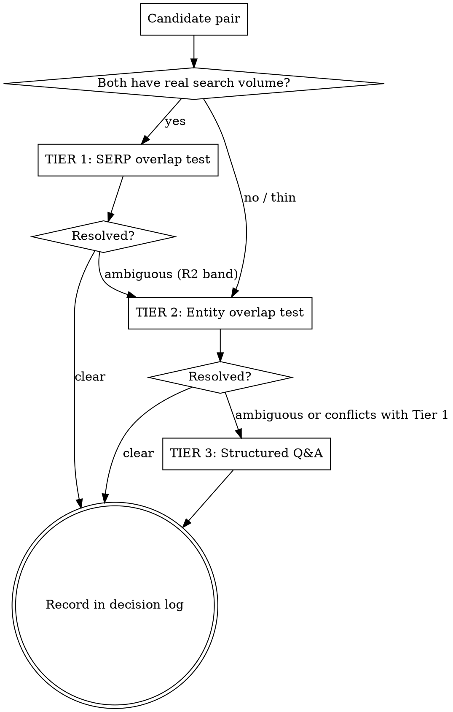

# Article Splitting: Method Reference

Deep reference for **Mode A** of `content-atomizer` — turning one very long article into the right
number of smaller articles, each with its own primary keyword, entity core, and reason to exist.

Loaded by `SKILL.md` when the user invokes splitting. Read this before proposing any split.

> **The governing bias: consolidate.** A false split costs you two thin pages that cannibalise each
> other and dilute one topic across two weak URLs. A missed split costs you one article that runs
> long. The first error is much more expensive than the second. When evidence is ambiguous, keep it
> together — **unless length forces the issue** (see Length Tiers below).

---

## The ruleset (this is the tuning surface — and it is debatable)

Every threshold the split logic uses lives in this one table. Nothing is hard-coded elsewhere in this
document. Tuning the skill means editing a row here, not hunting through prose.

**These rules are defaults, not law.** They are starting positions derived from general SEO practice,
not from your specific niche, audience, or content. Present them to the user and let them argue.

| ID | Rule | Default threshold | Applies when |
|---|---|---|---|
| **R1** | SERP overlap → **merge** (one article) | ≥ 7 shared URLs in top 10 | Both candidates have real search volume |
| **R2** | SERP overlap → same cluster, split only with documented angle | 4–6 shared | Both candidates have real search volume |
| **R3** | SERP overlap → **separate** articles | ≤ 3 shared | Both candidates have real search volume |
| **R4** | Entity overlap → **block the split** | ≥ 60% shared central entities | Always (works without search data) |
| **R5** | Entity overlap → split is safe on entity grounds | ≤ 35% shared central entities | Always |
| **R6** | Minimum real material per child | 1,200 words | Always |
| **R7** | Minimum central entities per child | 4 | Always |
| **R8** | Source already ranks → don't split it | Position ≤ 5 for its primary | Source is live and has ranking data |
| **R9** | Maximum children from one source | 5 | Soft cap — exceed only with explicit approval |
| **R10** | Minimum retained hub length (Shape A) | 1,800 words | Shape A only |

### Ruleset changelog

Record every tuning change so the logic's evolution is auditable.

| Date | Rule | From → To | Reason |
|---|---|---|---|
| — | — | — | Initial defaults |

---

## Mandatory step 0: present the ruleset

**Before running any analysis, show the user the ruleset above and the detected length tier, and ask
for overrides.** Do not silently apply thresholds.

```
SPLIT RULESET — review before I analyse

Source: [filename]  ·  [N] words  ·  Length Tier [T]
Detected posture: [Consolidate / Split expected / Split mandatory]

Active thresholds:
  R1 merge at        ≥7 shared SERP URLs
  R4 block split at  ≥60% shared entities
  R6 min child       1,200 words
  R7 min entities    4
  R9 max children    5
  [...]

Override any of these, or say "defaults" to proceed.
```

Log any override in the run's output so the resulting split map is reproducible.

---

## Length tiers (the consolidate bias is scale-dependent)

The consolidate bias is correct at normal article lengths. It stops being correct when the source is
physically too long to be one page. A 25,000-word URL is not a good article no matter how coherent
its topic is — it defeats navigation, buries the citable sections, and gives you one entry point
where the material could support six.

| Tier | Source length | Approx. pages | Default posture |
|---|---|---|---|
| **T1** | < 2,500 words | < 8 | **Don't split.** Almost never viable. Recommend against. |
| **T2** | 2,500–5,000 | 8–16 | **Consolidate hard.** Split only when Tier-1 and Tier-2 evidence both clearly say separate. |
| **T3** | 5,000–10,000 | 16–33 | **Consolidate.** Split on clear intent separation. Partial carve often the right answer. |
| **T4** | 10,000–20,000 | 33–66 | **Split expected.** The question is shape, not whether. Consolidate bias applies only to *how many*. |
| **T5** | 20,000+ | 66+ | **Split mandatory.** Related concepts → chaptered series. Separate concepts → independent articles. Usually a mix of both. |

**The T4/T5 reframe:** at these lengths the consolidate bias no longer decides *whether* to split — it
decides **which shape**. Related concepts that must separate for length become a **chaptered series
under one hub** (Shape D), which is how you split without cannibalising: the hub owns the head term,
the parts own distinct longtails, and the sequence is explicit. Concepts that are genuinely separate
become independent articles (Shape A/B). A 70-page source will usually produce both.

---

## The decision cascade

For each candidate pair ("should these two be one article or two?"), work down until something
resolves. **Use the strongest evidence available — and know when it isn't available.**



### Tier 1 — SERP overlap

Search each candidate primary, list the top 10 organic URLs, count how many appear in both. Apply
R1/R2/R3.

**Precondition:** both keywords must have real volume and a populated SERP. If either returns a
sparse, off-topic, or forum-only SERP, the count is noise — **skip to Tier 2 and say so in the
output.** Do not report a shared-URL count you don't trust.

**This tier fails silently on novel content.** Original research, proprietary methodology, in-house
test data, and genuinely new concepts have no SERP to measure. That is not a signal that the concepts
are separate — it's an absence of signal. Treat it as such.

### Tier 2 — Entity overlap

Extracted from the source text itself, so it works with zero search data. Full method in
`entity-extraction.md`. Apply R4/R5 against the **central** entity sets of the two candidates
(incidental entities are excluded — they inflate overlap without meaning anything).

**Entity overlap is the tiebreaker that blocks a split.** Two candidates can have cleanly distinct
primary keywords and still be the same article. Keyword difference is a surface property; shared
entity cores mean shared subject matter. When Tier 1 says "separate" and Tier 2 says "≥60% shared,"
**Tier 2 wins and the split is blocked** — consistent with the consolidate bias.

### Tier 3 — Structured Q&A with the user

Fires when: Tier 1 and Tier 2 conflict, both come back thin, or the material is novel enough that
neither the model's prior knowledge nor public search data can judge whether two things are one
concept.

**This is the tier that matters for original content.** If the source is your own research, testing,
or domain expertise, the model has no training-data basis for judging whether two of your concepts
are the same concept. Guessing is worse than asking. Ask.

**Rules for the Q&A:**

1. **Only on genuinely ambiguous pairs.** Never interrogate the user pair-by-pair through a whole
   article. If eight candidate pairs exist and six resolve on evidence, ask about two.
2. **Domain terms, not SEO terms.** Ask about readers and concepts, not keywords and cannibalisation.
   The person answering knows the subject; they should not need to know SEO to answer.
3. **Present your read and your confidence first.** The user is correcting a proposal, not
   originating an answer from a blank page.
4. **Batch related pairs into one exchange.** Don't serialise five separate prompts.
5. **Record every answer in the decision log.** Never ask the same pair twice.

**The five questions that actually separate concepts:**

| # | Question | Answer → keep together | Answer → split |
|---|---|---|---|
| 1 | **Co-consumption** — would a reader who needs X also need Y in the same sitting? | Yes | No |
| 2 | **Dependency** — does understanding X require understanding Y first? | Yes | No |
| 3 | **Audience** — do X and Y serve the same reader at the same stage? | Yes | No — different readers or stages |
| 4 | **Satisfaction** — would someone who came for X bounce off a page that's mostly Y? | No | Yes |
| 5 | **Decision** — is the reader making one decision here, or two? | One | Two |

Majority rules, but **Q2 (dependency) and Q4 (satisfaction) carry double weight.** A hard dependency
is the strongest reason to keep material together; a bounce risk is the strongest reason to separate.

**Ask like this:**

```
AMBIGUOUS PAIR 2 of 2

  A: "[candidate A working title]"   (sections 4, 5, 9 — 2,100w)
  B: "[candidate B working title]"   (sections 6, 7 — 1,600w)

  Tier 1 (SERP):    unavailable — neither phrase has measurable volume
  Tier 2 (entity):  47% shared central entities — inside the ambiguous band
  My read:          lean SEPARATE, low confidence

  1. Would someone who needs A also need B in the same sitting?
  2. Does A require understanding B first?
  3. Same reader at the same stage, or different?
  4. Would someone who came for A bounce off a page that's mostly B?
  5. One decision here, or two?
```

### Decision log

Every resolution — from any tier — gets a row. This is what stops re-litigation and what makes the
ruleset tunable from evidence rather than opinion.

| Pair | Tier used | Evidence | Decision | Date |
|---|---|---|---|---|
| A vs B | 2 | 71% shared entities | Merge | — |
| C vs D | 3 | Q&A: 4/5 separate, Q4 bounce risk high | Split | — |

**Closing the loop:** when the user answers the same *kind* of question the same way three times,
propose a new rule from the pattern and offer to add it to the ruleset table. That is how the logic
gets tuned from real decisions rather than guesses.

---

## The eight-step flow

### Step 1 — Viability gate

Most long articles should not be split. Check these before anything else:

| Check | Fails when | Action on failure |
|---|---|---|
| **Multiple intents?** | The article covers one intent thoroughly | Don't split — it's long because it's complete |
| **Independent demand?** | Candidate sections answer no query anyone asks separately | Don't split — they're supporting context |
| **Already ranking?** | Source is position ≤5 for its primary (R8) | Don't split — or Shape C only, carve nothing load-bearing |
| **Standalone material?** | Sections exist only to set up the main argument | Don't split — context isn't content |
| **Length tier** | T1, or T2 with no clear intent separation | Don't split |

**If the viability gate fails, say so and stop.** "This article should not be split, here's why" is a
correct and valuable output. Do not proceed to propose a split you don't believe in.

**T4/T5 exception:** at 10,000+ words the "multiple intents" and "already ranking" checks stop being
disqualifying and become shape inputs instead. A 70-page source that covers one intent thoroughly
still splits — into a chaptered series (Shape D), not independent articles.

### Step 2 — Section inventory

Map every H2/H3 in the source:

| Section | Words | Query it answers | Independent demand? | Already owned by another article? |
|---|---|---|---|---|
| H2: [heading] | 850 | [the question a reader brings] | Yes / No / Unknown | [article] or none |

"Unknown" is a legitimate and expected value for novel content. Don't force a guess — it routes the
pair to Tier 2/3 later.

### Step 2.5 — Entity extraction

Run the full procedure in `entity-extraction.md`. Produces the entity inventory, the section→entity
map, and the raw material for the Tier 2 overlap test. **Do this before grouping sections into
candidates** — entity distribution should drive the grouping, not merely audit it afterwards.

### Step 3 — Candidate children

Group sections into proposed articles. Each candidate needs, before it's allowed into the map:

- A **distinct primary keyword** — not a longtail variant of the source primary
- **3–6 secondaries**, **3–8 longtails** (fewer is acceptable for novel topics; note it)
- A **differentiating angle** vs. the source *and* every sibling
- **≥ R6 words** of real material (not padding)
- **≥ R7 central entities** of its own

A candidate that yields 600 words is a **section**, not an article. A candidate that inherits three
central entities is too thin to be credible on its topic. Both get folded back into the parent.

### Step 4 — Run the cascade

For every candidate pair — including each candidate against the retained source — work the decision
cascade above. Record every result in the decision log with the tier and evidence used.

### Step 5 — Choose the shape

Present the viable shapes with trade-offs and a recommendation. Let the user pick.

### Step 6 — Interlink map

- Hub links **down** to every spoke
- Each spoke links **up** to the hub and **across** to 1–2 siblings
- Shape D adds explicit sequential **prev/next**
- Respect whatever link-spacing rule your content pipeline enforces
- No orphans: every child must be reachable from the hub

### Step 7 — Validation

Every check must pass before the map is presented as final:

| Check | Requirement |
|---|---|
| No duplicate primaries | Among children, and against every existing article |
| Entity separation | Every child pair below R4 |
| Nothing orphaned | Every source section landed somewhere, or was explicitly cut |
| Source coherent | If retained, still reads as a complete argument — not a gutted stub (R10) |
| Redirects specified | Anything retired has a 301 target |
| Word counts real | Each child ≥ R6 without padding |
| Entity cores real | Each child ≥ R7 central entities |
| Within cap | ≤ R9 children, or explicit approval logged |

### Step 8 — Handoff

Approved map → each child runs through your content skill's full write flow, firing its own gates.
The split map does not write articles; it produces the briefs that do.

---

## The five shapes

### Shape A — Hub & spoke

Source stays as the pillar, trimmed to ≥ R10 words. Spokes carved out as independent articles with
their own primaries.

- **Use when:** the source ranks or has accumulated authority, and the carved topics have genuinely
  separate intent
- **Keeps:** existing rankings, accumulated links, the head term
- **Costs:** the hub must be genuinely rewritten as a pillar, not left as leftovers
- **Redirects:** none

### Shape B — Full replacement

Source retires. 301 to the strongest child. Every other child launches fresh.

- **Use when:** the source is a grab-bag with no coherent centre, or it doesn't rank
- **Keeps:** cleanest possible keyword separation
- **Costs:** forfeits the source URL's authority to a single child
- **Redirects:** required — source → strongest child

### Shape C — Partial carve

One or two sections leave as articles. Source survives ~90% intact.

- **Use when:** the source is mostly coherent but has one or two sections that clearly want to be
  their own page
- **Keeps:** almost everything; lowest risk
- **Costs:** lowest upside
- **Redirects:** none

### Shape D — Chaptered series

**The T4/T5 answer for related concepts.** Hub owns the head term and the overview; Parts 1–N are
sequential chapters, each owning a distinct longtail, with explicit prev/next navigation.

- **Use when:** the source is too long to be one page but the concepts are genuinely related — the
  Q&A says "keep together" and the length says "can't"
- **Keeps:** topical coherence with no cannibalisation — the hub owns the head term, so the parts
  aren't competing for it
- **Costs:** parts are weaker standalone entry points than true independent articles
- **Redirects:** none (source becomes the hub)
- **Requirements:** each part must still stand alone well enough to satisfy a cold arrival, and each
  must clear R6/R7 in its own right

### Shape E — Don't split

Always on the table. Recommend it whenever the viability gate fails or the cascade resolves toward
consolidation. Output the reasoning, not just the verdict.

### Presenting the shapes

```
SPLIT SHAPES — source: [file] · [N] words · Tier [T]

SHAPE A  Hub & spoke        hub [N]w + [n] independent spokes
         keeps rankings, adds [n] entry points
         RECOMMENDED — source ranks p[N] for its primary

SHAPE D  Chaptered series    hub [N]w + [n] sequential parts
         no cannibalisation, weaker standalone parts

SHAPE C  Partial carve       [n] section leaves, source ~90% intact
         lowest risk, lowest upside

SHAPE E  Don't split         reasoning: [...]

Recommendation: A, because [...]
```

---

## Anti-patterns

**Never split in order to:**

1. **Publish more.** Article count is not the goal. Two thin pages rank worse than one good one.
2. **Hit a word-count target.** Padding a child to clear R6 is how you manufacture thin content.
3. **Create a child whose primary is a longtail variant of the source primary.** That's guaranteed
   cannibalisation — the definition of it.
4. **Carve out context.** Sections that exist to set up the main argument die when separated. They
   read as fragments and satisfy nobody.
5. **Break a ranking page.** R8 exists for a reason. Position ≤5 means the current structure works.

**Also avoid:**

- Reporting a SERP-overlap count from a SERP you don't trust
- Letting keyword difference override entity overlap (R4 is the block, and it wins)
- Interrogating the user pair-by-pair when evidence already resolved most pairs
- Producing a hub that's just the leftovers after the good sections were carved out
- Splitting past R9 without explicit approval

---

## Worked example (T5, mixed shapes)

**Source:** 24,000-word internal methodology document (~72 pages). Original material — no meaningful
SERP data for most of its concepts.

**Length tier:** T5 → split mandatory, shape is the question.

**Section inventory:** 31 H2s. 19 have unknown independent demand (novel material).

**Entity extraction:** 47 central entities. Clustering shows three dense groups and one diffuse tail.

**Cascade:**
- Groups 1 vs 2: Tier 1 unavailable. Tier 2 → 22% shared entities → **separate** (R5)
- Groups 2 vs 3: Tier 1 unavailable. Tier 2 → 51% → ambiguous → **Tier 3 Q&A** → 4/5 answers say keep
  together, Q2 dependency is hard → **keep together**
- Tail sections: fail R6 individually → fold into nearest group

**Result — mixed shapes:**
- Group 1 → **independent article** (Shape A spoke), distinct entity core, own primary
- Groups 2+3 → **chaptered series** (Shape D): hub + 4 parts, related concepts that can't be one page
- Source → retired, 301 to the series hub (Shape B for the source URL itself)

**Total:** 1 independent article + 1 hub + 4 parts = 6 URLs from 1 source, within R9 after approval.
